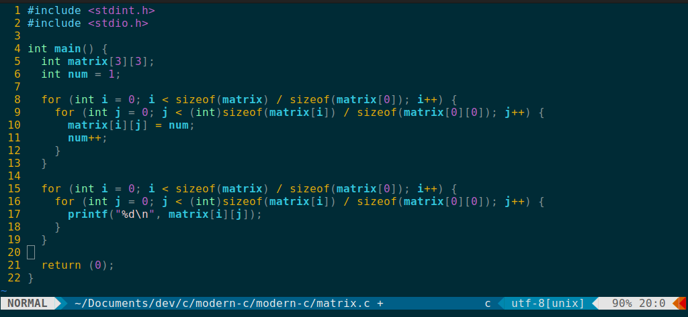

# .vimrc

My personal Vim setup

## Plugins

- [vim-airline/vim-airline](https://github.com/vim-airline/vim-airline)
- [vim-airline/vim-airline-themes](https://github.com/vim-airline/vim-airline-themes)
- [tpope/vim-fugitive](https://github.com/tpope/vim-fugitive)
- [yegappan/lsp](https://github.com/yegappan/lsp)
